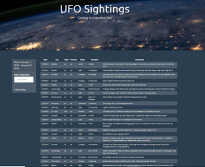
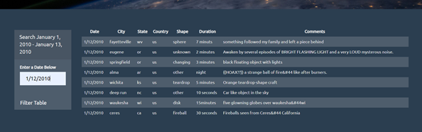

# JavaScript and DOM Manipulation

Using d3.js, JavaScript and HTML, a table is appended to a webpage and populated with given data. The user is able to filter the table based on user input. 

* Using an array of JavaScript objects in the UFO dataset provided, a table was appended to the web page and then new rows of data for each UFO sighting were added.

  

* JavaScript code is used to listen for events and search through the `date/time` column to find rows that match user input.

  

  ### Copyright
  Trilogy Education Services © 2019. All Rights Reserved.

